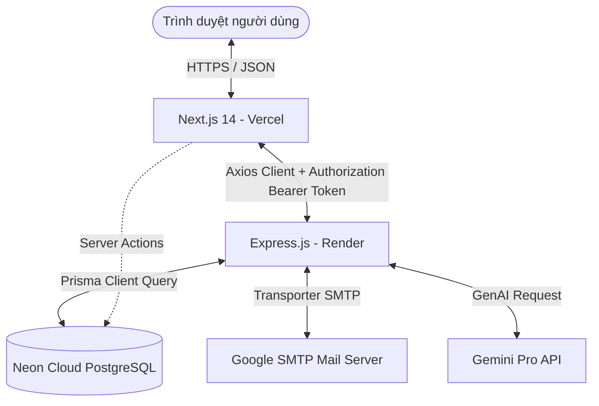

# Hướng dẫn chi tiết viết Báo cáo Đồ án Cuối kỳ Web (INT1334)
*(Dựa trên cấu trúc Báo cáo TTCS và Stack công nghệ mới: Next.js 14 + Express + Prisma)*

Tài liệu này hướng dẫn cách chuyển đổi nội dung từ Báo cáo Thực tập Cơ sở (TTCS) sang **Báo cáo Đồ án Cuối kỳ môn Lập trình Web (INT1334)**, làm nổi bật những cải tiến kỹ thuật bắt buộc theo yêu cầu của giảng viên môn Web.

---

## 🗺️ Bản đồ chuyển đổi chương & nội dung chính

| Chương trong Báo cáo TTCS | Thay đổi dịch chuyển sang Báo cáo Web | Nội dung kỹ thuật mới cần nhấn mạnh |
| :--- | :--- | :--- |
| **Trang bìa & Tên đề tài** | Đổi tên đề tài thành: **"Hệ thống Quản lý Kho thông minh WMS"** | Thêm các công nghệ chính: **Next.js 14, Express, Prisma ORM**. |
| **Chương 2. Lý thuyết & Công nghệ** | Thay Flask + SQLAlchemy bằng **Express.js + Prisma ORM + TypeScript**. Thay React Vite bằng **Next.js 14 App Router + Tailwind CSS + shadcn/ui**. | So sánh Express với Spring Boot/Django. So sánh Prisma với SQLAlchemy/Sequelize. So sánh Next.js 14 App Router với React SPA thuần. |
| **Chương 3. Phương pháp & Giải pháp** | Cập nhật sơ đồ kiến trúc hệ thống 3 tầng mới. Cập nhật bảng vật lý CSDL (thêm thực thể `RefreshToken`). | Giải thích cơ chế bảo vệ Route của **Next.js Middleware**. Giải thích cơ chế phân bổ **FEFO**, **Nodemailer** và **Gemini AI API**. |
| **Chương 4. Kết quả thực hiện** | Thay thế ảnh chụp giao diện cũ bằng giao diện mới (shadcn/ui, Recharts, Dark mode). | Thống kê bảng phân chia chiến lược render (**SSR, SSG, ISR**). Báo cáo kết quả **Jest Unit Test** (7/7 test cases PASS). |
| **Phụ lục A. Danh sách API** | Cập nhật bảng danh sách các API Express thực tế. | Thêm các API nâng cao: Gửi email cảnh báo, AI gợi ý đặt hàng. |

---

## ✍️ Chi tiết cách viết từng chương

### CHƯƠNG 1. GIỚI THIỆU ĐỀ TÀI
> [!NOTE]
> *Giữ nguyên 80% từ báo cáo TTCS vì nghiệp vụ quản lý kho theo lô (FEFO) và hạn sử dụng không thay đổi.*
* **1.1 & 1.2 Bối cảnh & Bài toán**: Giữ nguyên bối cảnh quản lý hàng cận hạn, nguyên tắc FEFO.
* **1.4 Phạm vi thực hiện**: Bổ sung thêm phạm vi công nghệ: 
  * "Xây dựng hệ thống hoàn chỉnh tách biệt Frontend và Backend, hỗ trợ chạy cục bộ qua Docker Container và triển khai Cloud (Vercel, Render)."

---

### CHƯƠNG 2. NỀN TẢNG LÝ THUYẾT VÀ LỰA CHỌN CÔNG NGHỆ
> [!IMPORTANT]
> *Đây là chương cần viết lại nhiều nhất để thể hiện năng lực lập trình Web hiện đại.*

#### 2.1. Lựa chọn Express.js làm Backend thay thế cho Flask:
* **Lý do chọn Node.js/Express**:
  * Hoạt động phi đồng bộ (Non-blocking I/O) giúp xử lý nhiều yêu cầu đồng thời (Concurrency) hiệu quả hơn Python/Flask trong các tác vụ I/O cao (nhập/xuất dữ liệu lớn).
  * Hệ sinh thái npm vô cùng phong phú, tích hợp dễ dàng với TypeScript để tăng tính an toàn kiểu dữ liệu (Type-safety).
* **Bảng so sánh framework backend**:
  * Đưa ra bảng so sánh giữa **Express.js**, **Django (Python)**, và **Spring Boot (Java)** để làm nổi bật tính gọn nhẹ, tốc độ phát triển nhanh của Express.

#### 2.2. Lựa chọn Prisma ORM thay thế cho SQLAlchemy:
* **Lý do chọn Prisma**:
  * Tự động sinh kiểu dữ liệu (Auto-generated TypeScript client) giúp tránh lỗi cú pháp khi truy vấn.
  * Định nghĩa cơ sở dữ liệu tập trung thông qua file `schema.prisma` rõ ràng, trực quan.
  * Cơ chế Migration mạnh mẽ (`npx prisma migrate dev`) giúp đồng bộ database mượt mà giữa các môi trường phát triển và production (Neon PostgreSQL).

#### 2.3. Lựa chọn Next.js 14 App Router thay thế cho React Vite:
* **Lý do chọn Next.js 14**:
  * **React Server Components (RSC)**: Cho phép kết xuất dữ liệu trực tiếp trên máy chủ trước khi gửi về client, giúp tăng tốc độ tải trang ban đầu và tối ưu SEO tốt hơn React SPA thuần.
  * **File-based Routing**: Quản lý route dễ dàng qua thư mục `app/`, không cần cấu hình `react-router-dom` phức tạp.
  * **Next.js Middleware**: Đánh chặn request trực tiếp tại tầng máy chủ Edge để bảo vệ các tuyến đường yêu cầu đăng nhập một cách nhanh chóng.
  * **Zustand thay thế Context API**: Quản lý trạng thái toàn cục (Auth token, thông tin user) nhẹ hơn, hiệu năng cao hơn, tránh re-render không mong muốn.

---

### CHƯƠNG 3. PHƯƠNG PHÁP THỰC HIỆN VÀ GIẢI PHÁP

#### 3.1. Sơ đồ kiến trúc tổng thể (Cập nhật):
Vẽ hoặc vẽ lại sơ đồ kiến trúc ứng dụng Web mới:

#### 3.2. Thiết kế Cơ sở dữ liệu (Cập nhật bảng `RefreshToken`):
* Bổ sung bảng `RefreshToken` vào danh sách bảng vật lý:
  * **Thuộc tính**: `id` (PK), `token` (String, Unique), `userId` (FK references `users.id`), `expiresAt` (DateTime), `createdAt` (DateTime).
  * **Ý nghĩa**: Phục vụ luồng quay vòng khóa đăng nhập an toàn, lưu vết token hợp lệ của thiết bị client ở phía server.

#### 3.3. Giải pháp Xác thực & Phân quyền nâng cao bằng Next.js Middleware:
* Trình bày luồng xác thực:
  * Đăng nhập ➔ Backend trả Access Token (lưu Cookie/LocalState) & Refresh Token (lưu DB & HttpOnly Cookie).
  * **Middleware**: Đánh chặn trước các route `/dashboard/:path*`. Nếu không có token hoặc token không hợp lệ, redirect ngay về `/login`.
  * **Axios Interceptor**: Tự động phát hiện mã lỗi `401 Unauthorized` từ backend ➔ gọi API `/auth/refresh` để xin Access Token mới và thực hiện lại request ban đầu mà không làm gián đoạn trải nghiệm người dùng.

#### 3.4. Giải pháp tích hợp Gemini AI và Nodemailer:
* **Gemini AI**: Lấy danh sách sản phẩm tồn thấp + lịch sử các phiếu nhập kho đã phê duyệt (`COMPLETED`). Định dạng JSON làm đầu vào gửi tới mô hình `gemini-1.5-flash` (hoặc `gemini-pro`) để nhận về các phân tích đề xuất đặt hàng thông minh (số lượng gợi ý, nhà cung cấp ưu tiên kèm đơn giá thực).
* **Nodemailer**: Khi kho có sản phẩm dưới ngưỡng tối thiểu, admin có thể nhấn nút kích hoạt gửi Email Cảnh báo. Backend Express tự động soạn bảng HTML danh sách hàng thiếu và gửi qua SMTP Server của Gmail.

---

### CHƯƠNG 4. KẾT QUẢ THỰC HIỆN

#### 4.1. Bảng phân bổ chiến lược Rendering tại Frontend:
Đây là yêu cầu cốt lõi của môn học Web để chứng minh việc hiểu bản chất của Next.js:

| Tuyến đường (Route) | Chiến lược Render | Phương pháp triển khai | Lý do lựa chọn |
| :--- | :--- | :--- | :--- |
| `/about` | **SSG (Static Site Generation)** | Component tĩnh không fetch dữ liệu động | Nội dung trang giới thiệu nhóm/dự án cố định, render sẵn khi build giúp tải trang tức thì. |
| `/dashboard` | **ISR (Incremental Static Regeneration)** | Cấu hình `export const revalidate = 60` | Dữ liệu thống kê KPI kho cần cập nhật định kỳ nhưng không cần real-time từng giây, tiết kiệm tài nguyên database. |
| `/dashboard/imports` | **SSR (Server-Side Rendering)** | Cấu hình `export const dynamic = 'force-dynamic'` | Danh sách phiếu nhập thay đổi liên tục khi nhân viên kho thao tác, cần hiển thị dữ liệu mới nhất. |
| `/dashboard/imports/new` | **CSR (Client-Side Rendering)** | Sử dụng `'use client'` | Màn hình cần tính tương tác cao: Quét QR camera, thêm/bớt dòng mặt hàng động, quản lý form state. |

#### 4.2. Báo cáo kiểm thử Jest (Mới):
* Liệt kê các test cases tự động đã triển khai tại `__tests__/stockValidation.test.js` để chứng minh ứng dụng được kiểm thử bài bản:
  1. Kiểm tra số lượng nhập/xuất phải lớn hơn 0.
  2. Tính toán tổng trị giá phiếu nhập chính xác.
  3. Phát hiện cảnh báo tồn kho thấp khi lượng tồn dưới hạn mức tối thiểu.
  4. Cảnh báo sản phẩm cận hạn sử dụng.

---

### CHƯƠNG 5. HẠN CHẾ VÀ HƯỚNG CẢI TIẾN
* **Hạn chế**:
  * Render.com và Neon DB sử dụng gói dịch vụ miễn phí (Free Tier) nên server backend tự động ngủ sau 15 phút không hoạt động, làm tăng thời gian chờ của request đầu tiên (khoảng 30 giây).
  * Chưa hỗ trợ đồng bộ dữ liệu thời gian thực (Real-time WebSockets) khi nhiều nhân viên kho cùng thao tác xuất nhập đồng thời.
* **Hướng cải tiến**:
  * Nâng cấp gói hạ tầng cloud để hệ thống luôn sẵn sàng.
  * Tích hợp Socket.io để cập nhật tồn kho tức thì khi có biến động.
  * Xây dựng phiên bản ứng dụng di động (React Native) quét barcode nhanh chóng.

---

### 📂 PHỤ LỤC: DANH SÁCH ENDPOINT API (BACKEND)
Trình bày bảng danh sách các API backend thực tế:

| Phương thức | API Endpoint | Phân quyền | Chức năng nghiệp vụ |
| :--- | :--- | :--- | :--- |
| `POST` | `/api/auth/login` | Public | Đăng nhập hệ thống, trả JWT |
| `POST` | `/api/auth/refresh` | Public | Đổi Refresh Token lấy Access Token mới |
| `GET` | `/api/auth/me` | Admin/Staff | Lấy thông tin tài khoản hiện tại |
| `GET` | `/api/products` | Admin/Staff | Lấy danh sách sản phẩm (có filter & phân trang) |
| `POST` | `/api/products` | Admin | Thêm sản phẩm mới |
| `GET` | `/api/inventory` | Admin/Staff | Lấy dữ liệu tồn kho tổng hợp (View `v_stock_balance`) |
| `GET` | `/api/inventory/lots` | Admin/Staff | Lấy chi tiết tồn theo lô hàng (View `v_lot_stock`) |
| `POST` | `/api/imports` | Staff | Lập phiếu nhập kho nháp |
| `PUT` | `/api/imports/:id/approve`| Admin | Phê duyệt phiếu nhập (cộng tồn kho thực tế) |
| `POST` | `/api/exports` | Staff | Tạo phiếu xuất (phân bổ FEFO tự động) |
| `GET` | `/api/inventory/ai-replenishment` | Admin | Gọi Gemini AI phân tích đề xuất đặt hàng |
| `POST` | `/api/alerts/send-email` | Admin | Gửi email HTML chứa danh sách tồn thấp cho Admin |
